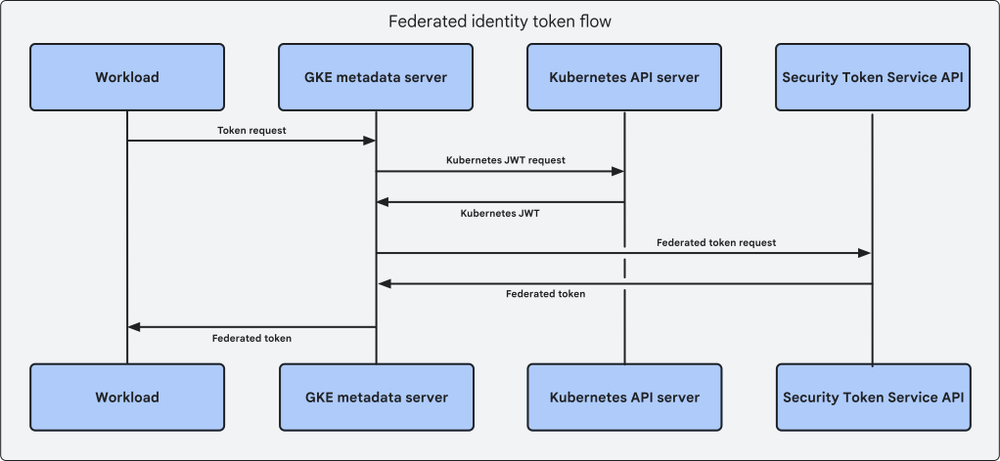

### Detailed
This module will showcase the integration of Workload Identity Federation and GKE to access Google Cloud services without a Service Account key.

The resources/services/activations/deletions that this module will create/trigger are:

- Create a Autopilot GKE Cluster
- Creates an isolated VPC with dedicated subnets 
- Update project IAM policy

## Creditial Flow


## Documentation
- [Workload Identity Federation Overview](https://cloud.google.com/kubernetes-engine/docs/concepts/workload-identity)
- [Daniel Strebel medium article ](https://medium.com/google-cloud/whoami-the-quest-of-understanding-gke-workload-identity-federation-e951e5e4a03f)

## Deployment Duration
Configuration: 5 mins
Deployment: 15 mins

## Cost
[Blueprint cost details](https://cloud.google.com/products/calculator?id=02fb0c45-cc29-4567-8cc6-f72ac9024add)

## Usage

1. Clone repo
```
git clone https://github.com/jasonbisson/terraform-google-workload-identity-gke.git

```

2. Rename and update required variables in terraform.tvfars.template
```
mv terraform.tfvars.template terraform.tfvars
#Update required variables
```
3. Execute Terraform commands with existing identity (human or service account) to build Vertex Workbench Infrastructure 

```
terraform init
terraform plan
terraform apply
```

4. Collect Kubernetes credentials from GKE cluster

``` 
gcloud container clusters get-credentials ap-private-cluster --region us-central1 --project your_project_id
```

5. Create a Kubernetes Service Account 
```
kubectl create serviceaccount workload-identity-sa
```

6. Create a simple Kubernetes Deployment running gcloud sdk
```
kubectl apply -f - <<EOF 
apiVersion: v1
kind: Pod
metadata:
  name: workload-identity
  namespace: default
spec:
  containers:
  - image: google/cloud-sdk:slim
    name: workload-identity
    command: ["sleep","infinity"]
  serviceAccountName: workload-identity-sa
EOF
```

7. Update the project IAM to provide the Kubernetes Service Account Google Cloud Access

```
mv ksa_gcp_access.tf.disable ksa_gcp_access.tf
terraform apply
```

8. Access the pod to run storage list command
```
kubectl exec -it workload-identity  -- /bin/bash
curl -X GET -H "Authorization: Bearer $(gcloud auth print-access-token)" \
"https://storage.googleapis.com/storage/v1/b/Any_bucket_in_project/o

```


<!-- BEGINNING OF PRE-COMMIT-TERRAFORM DOCS HOOK -->
## Inputs

| Name | Description | Type | Default | Required |
|------|-------------|------|---------|:--------:|
| bucket\_name | The name of the bucket to create | `string` | n/a | yes |
| project\_id | The project ID to deploy to | `string` | n/a | yes |

## Outputs

| Name | Description |
|------|-------------|
| bucket\_name | Name of the bucket |

<!-- END OF PRE-COMMIT-TERRAFORM DOCS HOOK -->

## Requirements

These sections describe requirements for using this module.

### Software

The following dependencies must be available:

- [Terraform][terraform] v0.13
- [Terraform Provider for GCP][terraform-provider-gcp] plugin v3.0

### Service Account

A service account with the following roles must be used to provision
the resources of this module:

- Storage Admin: `roles/storage.admin`

The [Project Factory module][project-factory-module] and the
[IAM module][iam-module] may be used in combination to provision a
service account with the necessary roles applied.

### APIs

A project with the following APIs enabled must be used to host the
resources of this module:

- Google Cloud Storage JSON API: `storage-api.googleapis.com`

The [Project Factory module][project-factory-module] can be used to
provision a project with the necessary APIs enabled.

## Contributing

Refer to the [contribution guidelines](./CONTRIBUTING.md) for
information on contributing to this module.

[iam-module]: https://registry.terraform.io/modules/terraform-google-modules/iam/google
[project-factory-module]: https://registry.terraform.io/modules/terraform-google-modules/project-factory/google
[terraform-provider-gcp]: https://www.terraform.io/docs/providers/google/index.html
[terraform]: https://www.terraform.io/downloads.html

## Security Disclosures

Please see our [security disclosure process](./SECURITY.md).
# terraform-google-workload-identity-gke
